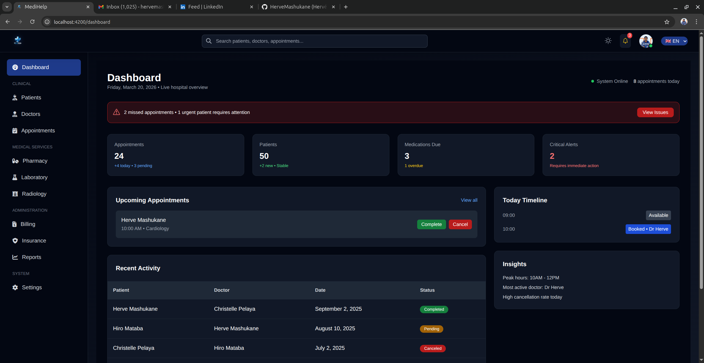

# MediHelper - Healthcare Management Dashboard

MediHelper is a scalable healthcare management dashboard interface built using Angular, TypeScript, and Tailwind CSS.

## 🚀 Features

- Dashboard overview interface
- Patient management UI
- Doctor management system
- Appointment scheduling interface
- Billing and insurance modules
- Laboratory, pharmacy, and radiology sections
- Administrative and system settings UI

## 🛠 Tech Stack

- Angular
- TypeScript
- Tailwind CSS

## 🎯 Purpose

This project demonstrates the ability to design and build complex, real-world dashboard interfaces with multiple interconnected modules.

## 🧱 Architecture

- Modular and scalable frontend structure
- Feature-based organization
- Reusable UI components

## 📸 Screenshots

## 📌 Notes

This project focuses on frontend architecture and UI design for large-scale applications.